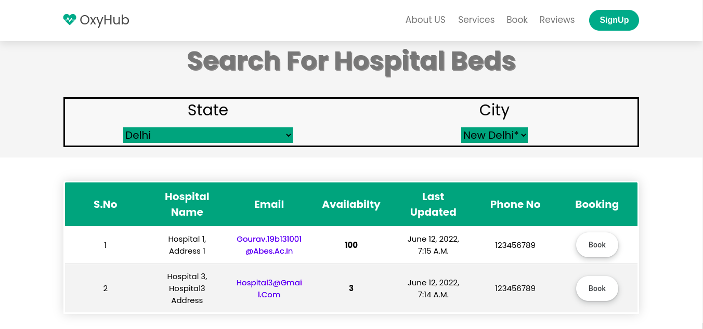

# NEEV PROJECT

* Neev is a web portal that gives you the details of bed and oxygen cylinder facility in your nearest location.
* Some Hospitals have available ```Beds and Oxygen Cylinders``` but people were not aware of them due to the lack of a platform where this information is available.​
* So, this project aims to give an idea regarding the problem in the form of a platform which organizes and shows the details of available Beds and Oxygen Cylinders supply in your ```nearest location.```

# High level project goals

1. Publish a public dataset that gives the data regarding the availability of oxygen and bed according to the given location.

2. Booking of beds/oxygen cylinders online through this portal directly from your home.

# How to start the Project

1. ```fork``` the repo.
2. ```clone``` to your local machine.

```Make sure you have Python3 installed in your system and pip as well```

3. Now go to the same directory where the ```NeevProject Folder``` is present.
4. Type on terminal ```pip install -r requirements.txt```.(This Will install all the dependencies for the project)
5. Now on terminal type ```python manage.py runserver```.


6. Now ctrl+click on  ```http://127.0.0.1:8000/```.

# Flowchart
* This is the overall flow of the project.


# Reference Video
<video src=" extrafiles/videos/VID-20220410-WA0008.mp4 ">

# Reference Images





